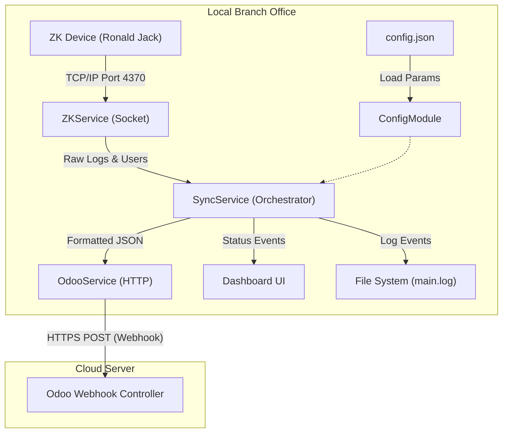

# Mayhomes ZK Sync Agent 📡

[Vietnamese version below]

## 🌐 English Overview

The **Mayhomes ZK Sync Agent** is an Electron-based middleware designed to bridge the connectivity gap between local **Ronald Jack (ZK)** attendance hardware and the **Odoo Cloud** platform.

### 🔄 Data Flow Diagram



### 📋 Key Features
- **Reliable Sync**: Automated polling with exponential backoff retries for unstable internet.
- **Background Execution**: Runs silently in the system tray with auto-start capability.
- **Monitoring Dashboard**: Modern UI for real-time status and manual synchronization triggers.
- **Branch Specific**: Easily configurable via `config.json` without re-building the code.

---

## 🇻🇳 Tổng quan dự án (Vietnamese)

Hệ thống đồng bộ dữ liệu chấm công từ máy Ronald Jack (ZK) về Odoo Cloud dành cho chi nhánh Mayhomes.

## 🏗 Cấu trúc Thư mục

Dự án được xây dựng theo kiến trúc **Practical Layered Architecture** (Kiến trúc phân lớp thực dụng), đảm bảo tính tách biệt và dễ bảo trì.

```text
electron-zk-agent/
├── assets/             # Chứa tài nguyên tĩnh (Icon app, hình ảnh)
├── dist/               # Chứa code JavaScript đã biên dịch (không sửa ở đây)
├── src/                # THƯ MỤC SOURCE CODE CHÍNH (Sửa code tại đây)
│   ├── config/         # Quản lý cấu hình hệ thống
│   │   └── index.ts    # Load và validate file config.json
│   ├── services/       # Nơi chứa Business Logic (Logic nghiệp vụ lõi)
│   │   ├── zk.service.ts    # Kết nối, lấy dữ liệu từ máy chấm công ZK
│   │   ├── odoo.service.ts  # Đẩy dữ liệu lên Odoo Webhook qua HTTPS
│   │   └── sync.service.ts  # Điều phối (Orchestrator) kết nối ZK và Odoo
│   ├── tray/           # Giao diện System Tray (Góc đồng hồ)
│   │   └── TrayManager.ts   # Quản lý icon và menu chuột phải của app
│   ├── ui/             # Giao diện Dashboard chính
│   │   └── index.html       # HTML/CSS/JS của cửa sổ Dashboard
│   ├── types/          # Định nghĩa kiểu dữ liệu (TypeScript Interfaces)
│   │   ├── index.ts         # Các interface dùng chung toàn app
│   │   └── zklib.d.ts       # Khai báo kiểu cho thư viện node-zklib
│   ├── utils/          # Các công cụ hỗ trợ (Utilities)
│   │   ├── logger.ts        # Ghi log ra console và file (debug từ xa)
│   │   └── retry.ts         # Cơ chế thử lại khi mạng chập chờn
│   └── main.ts         # Điểm khởi đầu (Entry Point) của ứng dụng
├── config.json         # File cấu hình (IP máy ZK, Webhook URL, Token)
├── package.json        # Quản lý thư viện và các lệnh build/start
└── tsconfig.json       # Cấu hình biên dịch TypeScript
```

## 🛠 Giải thích các file quan trọng

| File | Chức năng |
| :--- | :--- |
| `main.ts` | Khởi tạo app, quản lý vòng đời cửa sổ (Dashboard) và lên lịch chạy ngầm. |
| `sync.service.ts` | "Bộ não" của app. Lấy data từ `ZKService`, transform (chuyển đổi) dữ liệu và đẩy qua `OdooService`. |
| `zk.service.ts` | Sử dụng thư viện `node-zklib` để giao tiếp TCP với máy chấm công. Có cơ chế tự đóng socket để tránh treo máy. |
| `odoo.service.ts` | Đảm nhiệm việc "nói chuyện" với Odoo. Có tích hợp `retry` để tự động gửi lại nếu mạng chi nhánh bị lag. |
| `config.json` | Cho phép thay đổi IP máy chấm công mà không cần build lại code. Cực kỳ quan trọng khi triển khai cho nhiều chi nhánh. |
| `logger.ts` | Ghi log vào `%AppData%/zk-sync-agent/logs/main.log`. Giúp kỹ thuật viên xử lý sự cố mà không cần mở code. |

## 🚀 Các lệnh vận hành

- **`npm install`**: Cài đặt các thư viện cần thiết.
- **`npm run build:ts`**: Biên dịch toàn bộ code TypeScript sang JavaScript (lưu vào thư mục `dist`).
- **`npm start`**: Chạy ứng dụng ở chế độ Dashboard để kiểm tra.
- **`npm run build:win`**: Đóng gói ứng dụng thành file `.exe` để cài đặt lên Windows.
