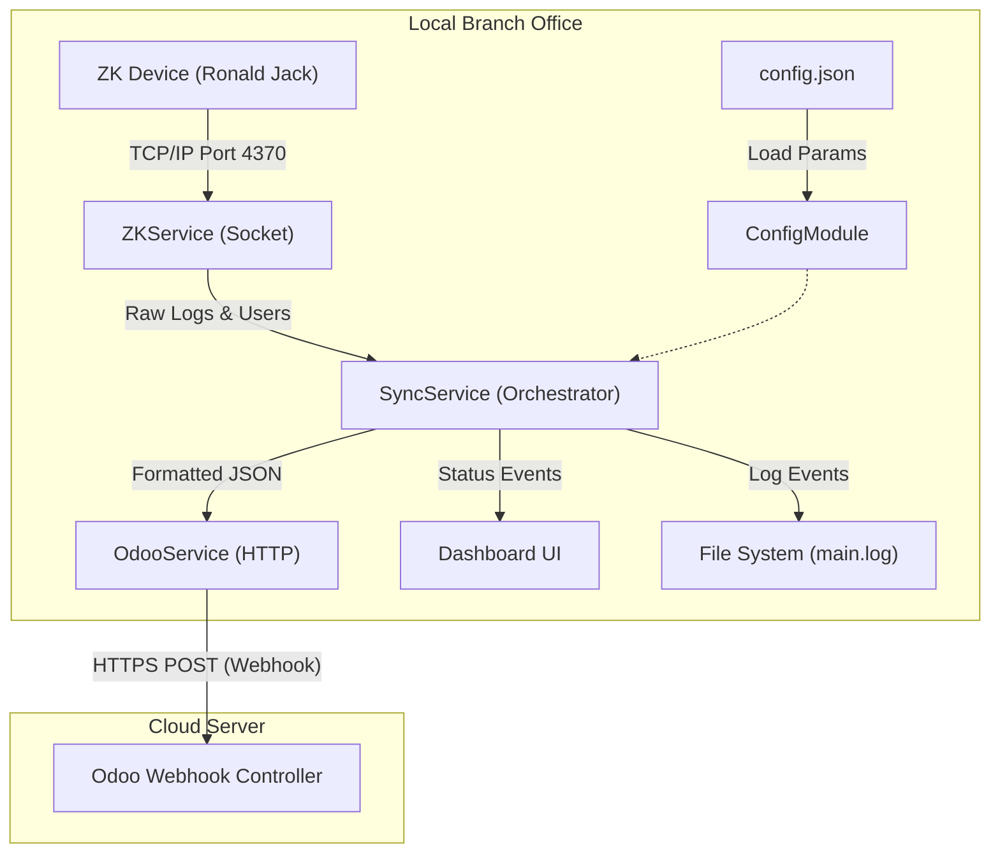

# ZK Sync Agent 📡

[Vietnamese version below]

## 🌐 English Overview

The **ZK Sync Agent** is an Electron-based middleware designed to bridge the connectivity gap between local **Ronald Jack (ZK)** attendance hardware and the **Odoo Cloud** platform.

### 🔄 Data Flow Diagram

### 📋 Key Features
- **Reliable Sync**: Automated polling with exponential backoff retries for unstable internet.
- **Background Execution**: Runs silently in the system tray with auto-start capability.
- **Monitoring Dashboard**: Modern UI for real-time status and manual synchronization triggers.
- **Branch Specific**: Easily configurable via `config.json` without re-building the code.

---
